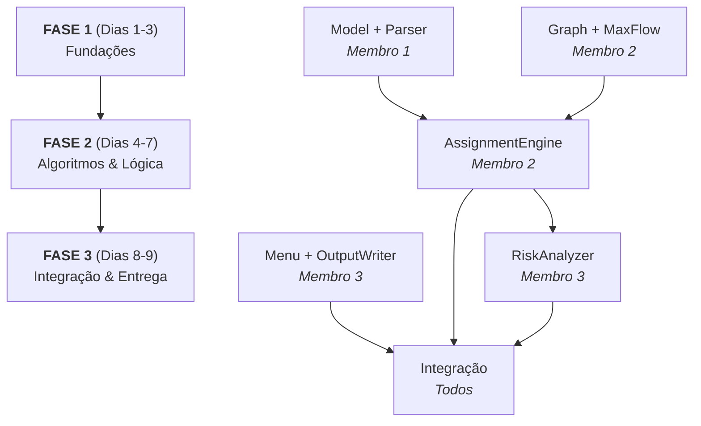

# 📋 Divisão de Tarefas — DA Projeto 1

**Deadline:** 30 de Março de 2026, 23:59  
**Hoje:** 21 de Março → **9 dias restantes**

---

## Mapa de Dependências



---

## 👤 Membro 1 — Dados & Parsing

**Ficheiros:** `model/` + `parser/`

| Fase | Tarefa | Ficheiros | Task |
|------|--------|-----------|------|
| 1 | Classes de domínio: `Submission`, `Reviewer`, `Config` | `model/*.h` + `model/*.cpp` | T1.2 |
| 1 | Parser CSV com validação de erros | `parser/CsvParser.h/.cpp` | T1.2 |
| 2 | Formulação geral (primário + secundário) — **outline teórico** | Relatório/PPT | T2.4 |
| 3 | Doxygen das suas classes + README | docs/ | T1.3 |
| 3 | Secção do PPT: modelo de dados e parsing | PPT | T3.1 |

**Pontos diretos:** T1.2 (1.0) + T2.4 (3.0) = **4.0 pts** + contribuição partilhada em T1.3/T3.1

> [!IMPORTANT]
> O Membro 1 é o **primeiro a começar** — os outros dependem dos modelos e do parser. Prioridade máxima nos primeiros 2 dias.

### Detalhes de implementação

**`Submission`** — campos: `id`, `title`, `authors`, `email`, `primaryTopic`, `secondaryTopic`  
**`Reviewer`** — campos: `id`, `name`, `email`, `primaryExpertise`, `secondaryExpertise`  
**`Config`** — campos: `minReviewsPerSubmission`, `maxReviewsPerReviewer`, flags de domínio, `generateAssignments`, `riskAnalysis`, `outputFileName`  
**`CsvParser`** — parse das 4 secções (`#Submissions`, `#Reviewers`, `#Parameters`, `#Control`), ignorar comentários após `#`, validar IDs únicos e campos obrigatórios

---

## 👤 Membro 2 — Grafos & Algoritmos

**Ficheiros:** `graph/` + `core/AssignmentEngine`

| Fase | Tarefa | Ficheiros | Task |
|------|--------|-----------|------|
| 1 | Estrutura `Graph` (baseada nas TPs) | `graph/Graph.h/.cpp` | T1.2 |
| 1 | Algoritmo Max-Flow (Edmonds-Karp) | `graph/MaxFlow.h/.cpp` | T2.1 |
| 2 | `AssignmentEngine`: construir rede de fluxo e extrair assignment | `core/AssignmentEngine.h/.cpp` | T2.1 |
| 2 | Risk Analysis K>1 — **outline teórico** | Relatório/PPT | T2.3 |
| 3 | Doxygen + **análise de complexidade** dos algoritmos | docs/ | T1.3 |
| 3 | Secção do PPT: grafo, Max-Flow, decisões de modelação | PPT | T3.1 |

**Pontos diretos:** T2.1 (4.0) + T2.3 (3.0) = **7.0 pts** + contribuição partilhada em T1.3/T3.1

> [!NOTE]
> T2.3 é apenas **outline** (não precisa de implementação completa), o que compensa o peso do T2.1. A análise de complexidade (T1.3) recai maioritariamente neste membro.

### Detalhes de implementação

**Rede de fluxo a construir:**
```
Source → [Topic nodes] → [Submission nodes] → [Reviewer nodes] → Sink
```
- Aresta Source→Topic: capacidade = ∑ submissions desse tópico × minReviews
  - Aresta Topic→Submission: capacidade = minReviewsPerSubmission
  - Aresta Submission→Reviewer (se match de domínio): capacidade = 1
  - Aresta Reviewer→Sink: capacidade = maxReviewsPerReviewer

**Edmonds-Karp** (BFS-based Ford-Fulkerson): complexidade O(VE²)

---

## 👤 Membro 3 — Interface, Output & Risk

**Ficheiros:** `ui/` + `core/OutputWriter` + `core/RiskAnalyzer`

| Fase | Tarefa | Ficheiros | Task |
|------|--------|-----------|------|
| 1 | Menu CLI interativo | `ui/Menu.h/.cpp` | T1.1 |
| 1 | Modo batch (`-b input.csv risk.csv`) | [main.cpp](file:///home/francisco/Desktop/DA/DA-Project/src/main.cpp) + `ui/Menu` | T1.1 |
| 2 | `OutputWriter`: formatar output CSV (assignments, missing reviews) | `core/OutputWriter.h/.cpp` | T1.1 |
| 2 | `RiskAnalyzer`: Risk Analysis K=1 (remover 1 reviewer e re-testar) | `core/RiskAnalyzer.h/.cpp` | T2.2 |
| 3 | Doxygen das suas classes | docs/ | T1.3 |
| 3 | Secção do PPT: demo do menu, risk analysis | PPT | T3.1 |

**Pontos diretos:** T1.1 (1.0) + T2.2 (3.0) = **4.0 pts** + contribuição partilhada em T1.3/T3.1

### Detalhes de implementação

**Menu** — opções: (1) Carregar ficheiro CSV, (2) Listar submissions, (3) Listar reviewers, (4) Ver parâmetros, (5) Gerar assignment, (6) Risk analysis, (0) Sair  
**Batch mode** — `./myProg -b input.csv risk.csv`  
**Risk K=1** — para cada reviewer r: remover r do grafo → correr Max-Flow → verificar se todas as submissions têm reviews suficientes → se não, r é "arriscado"

---

## ⚖️ Equilíbrio de Carga

| Membro | Pts Diretos | Esforço Real | Justificação |
|--------|-------------|-------------|--------------|
| **M1** | 4.0 + ~1.7 partilhados | ⭐⭐⭐ | T2.4 é outline; parsing é work intensivo mas well-defined |
| **M2** | 7.0 + ~1.7 partilhados | ⭐⭐⭐⭐ | T2.1 é o core do projeto mas T2.3 é só outline |
| **M3** | 4.0 + ~1.7 partilhados | ⭐⭐⭐ | T2.2 requer pensar mas reutiliza o Max-Flow do M2 |

> O M2 tem mais pontos diretos, mas T2.3 (3.0pt) é **apenas outline teórico**. O esforço real de implementação é equilibrado.

---

## 📅 Timeline

| Dia | Data | Fase | M1 | M2 | M3 |
|-----|------|------|----|----|-----|
| 1-2 | 21-22 Mar | **FASE 1** | Models + Parser | Graph + MaxFlow | Menu + batch mode |
| 3 | 23 Mar | **FASE 1** | Parser completo ✅ | MaxFlow testado ✅ | Menu funcional ✅ |
| 4-5 | 24-25 Mar | **FASE 2** | T2.4 outline | AssignmentEngine | OutputWriter |
| 6 | 26 Mar | **FASE 2** | T2.4 outline | Testes E2E | RiskAnalyzer (T2.2) |
| 7 | 27 Mar | **Integração** | Integração + testes | Integração + testes | Integração + testes |
| 8 | 28 Mar | **FASE 3** | Doxygen | Doxygen + complexidade | Doxygen |
| 9 | 29 Mar | **FASE 3** | PPT + README | PPT | PPT + demo |
| — | **30 Mar** | **DEADLINE** | 🚀 Submissão | 🚀 | 🚀 |

> [!CAUTION]
> O dia 27 (integração) é crítico. Todos os componentes devem estar prontos para juntar. Marcar reunião de grupo nesse dia.

---

## 🤝 Contratos de Interface (combinar ANTES de programar)

Para os 3 membros poderem trabalhar em paralelo, é essencial definir as interfaces comuns:

1. **M1 ↔ M2/M3**: Que métodos expõem `Submission`, `Reviewer` e `Config`? (getters)
   2. **M1 ↔ M2**: Como o `CsvParser` devolve os dados? (vectores de Submission/Reviewer + Config)
   3. **M2 ↔ M3**: Como invocar o `AssignmentEngine`? (recebe dados do parser, devolve assignment)
   4. **M2 ↔ M3**: Como o `RiskAnalyzer` acede/modifica o grafo para simular remoção de reviewers?
